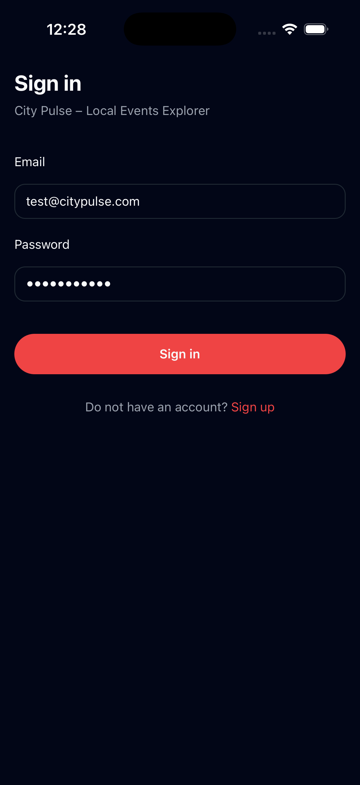
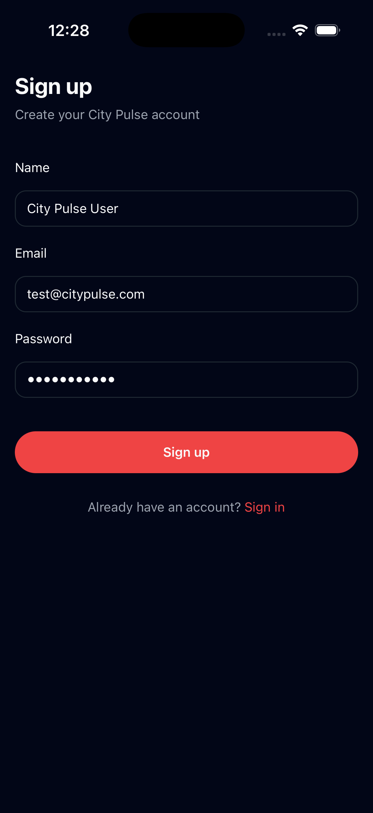
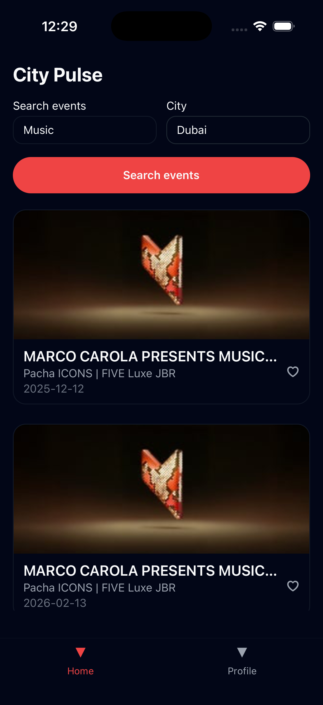
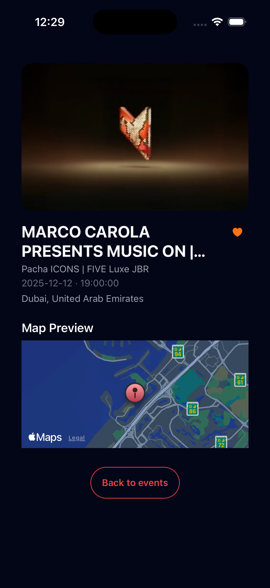

# Local Events Explorer

A React Native **bare** mobile application for exploring local events using the Ticketmaster Discovery API (or local mock data).  
Built with React Native 0.82, React Navigation, AsyncStorage, i18next, and a small custom design system (light / dark).

---

## 📱 Features

### Core Features

- ✅ **Home screen with event search** (keyword + city) using Ticketmaster Discovery API (or mocked events)
- ✅ **Event detail screen** with hero image, venue, date / time, city and country
- ✅ **Favourite events** stored locally using AsyncStorage
- ✅ **Navigation flow**  
  `Splash → Sign In → Sign Up → Biometric Gate → MainTabs (Home / Profile) → Event Details`
- ✅ **User profile screen**
  - Shows basic user information (name / email)
  - Language selection
  - Biometric toggle
  - Logout
- ✅ **User data saved locally** (mock auth + AsyncStorage)
- ✅ **Clean, modular architecture** with a shared `bridge` folder for hooks and business logic

### 🌟 Bonus Features

- ✅ **Map preview** in event details using `react-native-maps`
  - Map preview shown on **iOS** (Apple Maps)
  - When a Google Maps API key is not configured on Android, the map preview is gracefully skipped to avoid crashes
- ✅ **Biometric authentication** using `react-native-biometrics`
  - Optional biometric gate after login and on app relaunch
- ✅ **Multilingual support (English & Arabic)** via `i18next` and `react-i18next`
  - RTL layout support for Arabic using `I18nManager.forceRTL`
  - Language preference persisted across sessions with AsyncStorage
- ✅ **System-based light / dark mode**
  - The app theme automatically follows the device color scheme
  - Design system exposes `theme.colors` and `theme.typography` so components adapt automatically
- ✅ **Bottom tab navigation**
  - `Home` and `Profile` available in a bottom tab bar for a more app-like UX

### Not Implemented (Optional Bonus)

- ❌ Firebase (Auth, Firestore, Storage) – for this assessment, authentication is implemented locally instead of using Firebase

---

## 🔐 Authentication

This app uses **local mock authentication** with AsyncStorage to keep the assessment self-contained and easy to run.

### Test Credentials

You can use the following credentials for sign in:

Email:    <test@citypulse.com>  
Password: password123

### Auth Flow

- **Sign Up**
  - User enters `name`, `email`, and `password`
  - User is stored locally via `authStorage` (AsyncStorage)
  - Navigates into the app (Biometric Gate → MainTabs)

- **Sign In**
  - Credentials are checked against fixed mock values
  - On success, user is persisted locally and navigated into the app

- **Biometric Gate**
  - On app launch:
    - If biometric login is enabled and supported:
      - User is taken to the **Biometric Gate** screen
      - Successful biometric check routes to `MainTabs`
      - Failure clears auth and returns to `SignIn`
    - If biometric is disabled or not supported:
      - App skips directly to `MainTabs`

Auth-related logic is centralised under `src/bridge/auth` and `src/bridge/settings`.

---

## 🎟 Ticketmaster API & Mock Data

The app is designed to work both **with** and **without** a Ticketmaster API key.

Configuration file:

src/config/env.ts

export const TICKETMASTER_API_KEY = ''; // left empty on purpose  
export const TICKETMASTER_BASE_URL = '<https://app.ticketmaster.com/discovery/v2>';

- If `TICKETMASTER_API_KEY` is **set locally (not committed)**:
  - `fetchEvents` in `src/services/api/ticketmasterClient.ts` uses the Ticketmaster Discovery API.
- If the key is **empty or invalid**:
  - The app gracefully falls back to **local mock events** from `src/mocks/events.ts`.

This repository intentionally does **not** contain any real API keys.  
For local testing with Ticketmaster:

1. Generate your own key from the Ticketmaster developer portal.
2. Locally (without committing), set:

export const TICKETMASTER_API_KEY = 'YOUR_OWN_KEY_HERE';

If you prefer, you can run the entire app with mock events only and skip the external API.

---

## 🌍 Multilingual & RTL Support

The app supports:

- **English (en)** – default, LTR layout  
- **Arabic (ar)** – RTL layout

Implementation details:

- `i18next` + `react-i18next` with JSON resources:
  - `src/i18n/en.json`
  - `src/i18n/ar.json`
- `src/i18n/index.ts`:
  - Detects device locale via `react-native-localize`
  - Reads / writes selected language to AsyncStorage
  - Applies RTL via `I18nManager.forceRTL`
- Language can be changed from the **Profile** screen.
- After switching to Arabic, a full app restart is recommended for complete RTL layout application (this is a usual React Native RTL constraint).

---

## 🎨 Design System & Theming

The app uses a small, custom design system under `src/designSystem`:

- `ThemeProvider.tsx`
  - Uses `useColorScheme()` to follow the system **light / dark** mode
  - Exposes:
    - `theme.mode` – `'light' | 'dark'`
    - `theme.colors` – palette (background, surface, card, primary, accent, text colors, borders, etc.)
    - `theme.typography` – simple variants: `heading1`, `heading2`, `body`, `caption`
- `colors.ts`
  - Contains the base palette and per-mode color maps (`lightColors` / `darkColors`)
- Reusable components:
  - `components/Text.tsx` – uses `theme.typography[variant]` and `theme.colors[color]`
  - `components/Button.tsx`
  - `components/Screen.tsx` – wraps content in a safe area and uses the theme background

All screens rely on these primitives to automatically adapt to both light and dark modes.

---

## 🧭 Navigation Flow

Navigation is built using React Navigation:

- Stack: `@react-navigation/stack`
- Tabs: `@react-navigation/bottom-tabs`
- Root navigation:

`Splash → SignIn → SignUp → BiometricGate → MainTabs(Home / Profile) → EventDetail`

`MainTabs` contains:

- `Home` – event search and list
- `Profile` – profile and settings

---

## 📄 Screens

High level screen overview:

- **Splash**
  - Initialisation of i18n and auth state
- **Sign In**
  - Email / password login
  - Link to Sign Up
- **Sign Up**
  - Create mock account (name, email, password)
  - Persisted via AsyncStorage
- **Biometric Gate**
  - Optional biometric verification on app start if enabled
- **Home**
  - Search events by keyword and city (default: Dubai)
  - Shows list of events (name, venue, date, favourite)
- **Event Detail**
  - Hero image
  - Title, venue, date / time, city / country
  - Favourite toggle
  - Map preview (iOS only when API key is not configured on Android)
- **Profile**
  - Shows user name / email
  - Language selection: English / Arabic
  - Biometric login toggle (where supported)
  - Logout

---

## 📸 Screenshots

| Sign In | Sign Up (Dark) | Home (Dark) | Event Detail |
| ------ | ------------- | ----------- | ------------ |
|  |  |  |  |

---

## 🧱 Project Structure

```text
src/  
  app/  
    AppProviders.tsx          # Root providers (theme, navigation, i18n)  
    RootNavigator.tsx         # Stack navigator (auth + main flow)  
    MainTabs.tsx              # Bottom tab navigator (Home / Profile)  
  bridge/  
    auth/  
      authStorage.ts          # AsyncStorage wrapper for user / biometric flags  
      useAuth.ts              # Auth hook (signIn, signUp, signOut, load user)  
    events/  
      useEventSearch.ts       # Event search (Ticketmaster + fallback to mocks)  
    favourites/  
      useFavourites.ts        # Favourite events persisted in AsyncStorage  
    settings/  
      useSettings.ts          # Biometric availability, toggling, validation  
  config/  
    env.ts                    # Ticketmaster configuration (no keys committed)  
  designSystem/  
    ThemeProvider.tsx         # Light / dark theme provider  
    colors.ts                 # Color palettes  
    components/  
      Button.tsx  
      Screen.tsx  
      Text.tsx  
  i18n/  
    index.ts                  # i18next setup  
    en.json  
    ar.json  
  mocks/  
    events.ts                 # Local mock events used when API is unavailable  
  modules/  
    auth/  
      screens/  
        SplashScreen.tsx  
        SignInScreen.tsx  
        SignUpScreen.tsx  
        BiometricGateScreen.tsx  
    events/  
      screens/  
        HomeScreen.tsx  
        EventDetailScreen.tsx  
    profile/  
      screens/  
        ProfileScreen.tsx  
  services/  
    api/  
      ticketmasterClient.ts   # Ticketmaster Discovery API client  
    biometric/  
      biometricService.ts     # Wrapper around react-native-biometrics  
```

---

### 🚀 Setup & Running

#### Prerequisites

- Node.js **20+**  
- Yarn or npm  
- Xcode (for iOS) / Android Studio (for Android)  
- CocoaPods (`sudo gem install cocoapods`)

##### Install Dependencies

yarn  

##### or  

npm install

##### iOS

``` text
cd ios  
pod install  
cd ..  
yarn ios  
or 
npx react-native run-ios
```

##### Android

``` text
yarn android  
or  
npx react-native run-android
```

The app will start with:

- Language chosen based on device locale (falling back to English)  
- Theme (light / dark) derived from the device color scheme

---

## 📝 Assumptions

- Default city for searches is **Dubai, UAE**.  
- Biometric authentication is only available on devices that support it.  
- When the Ticketmaster API is unreachable or the key is not configured, the app falls back to mocked events.  
- User data and preferences are safely stored on-device via AsyncStorage:
  - User profile
  - Favourites
  - Language preference
  - Biometric preference

---

## 🐛 Known Limitations

- **Google Maps API key** is not configured in the public repo:
  - Map preview is enabled on iOS.
  - On Android, the map section is skipped when an API key is not configured in order to keep the app stable.
- Biometric authentication behaviour may vary by simulator / device – best tested on a physical device.  
- Full RTL layout sometimes requires a manual app restart after switching to Arabic.  
- No pagination for event lists – a single page of results is fetched or mocked per search.
